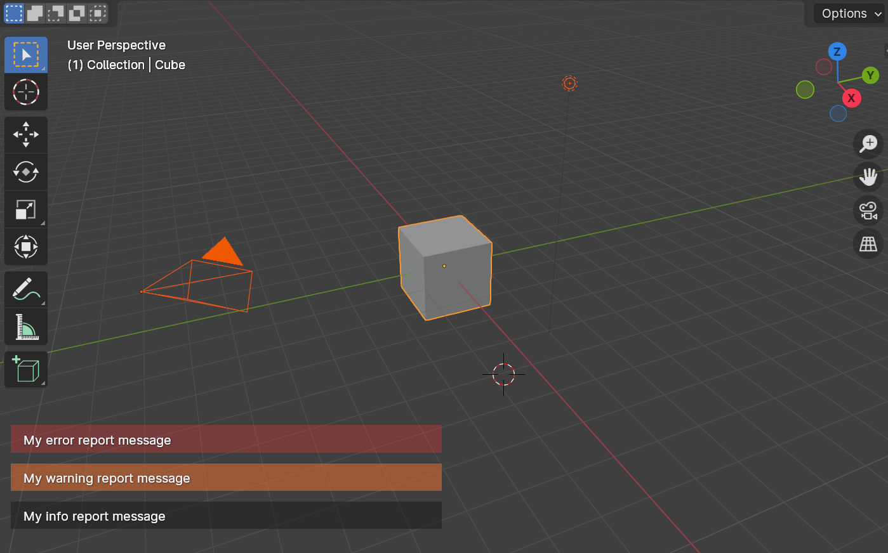
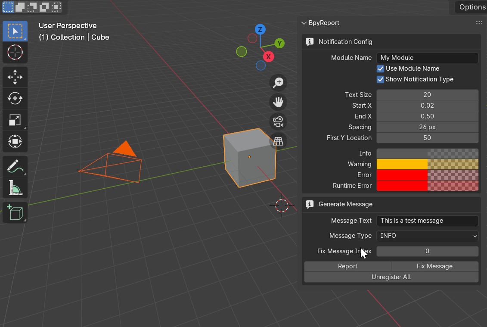

# BpyReport

**BpyReport** is a submodule designed to simplify and enhance the reporting of messages in Blender add-ons. It provides a more efficient and controlled way to display report messages with minimal setup.

## Installation

Installing **BpyReport** is straightforward. Simply clone the `src/bpyreport` directory into an internal folder of your add-on (e.g., a `libs` folder). You can then access the `bpyreport` module through relative imports in any module of your add-on.

```bash
your_addon_module
├── addon
├── libs # internal libs folder
│   └── bpyreport # BpyReport submodule
└── __init__.py  # Your add-on init file
```

## Usage

Using **BpyReport** is very simple. To display an information message, follow the example below:

```python
from .libs import bpyreport

bpyreport.info("My info report message")
bpyreport.warning("My warning report message")
bpyreport.error("My error report message", remove_in_time=5)
```
Result:



## Temporary and Fixed Messages
BpyReport allows you to generate two types of messages:

- Temporary Messages: These messages stay on the screen for a limited time before disappearing automatically.
- Fixed Messages: These messages remain on the screen until they are manually dismissed or replaced by another message.

## Customization

You can easily customize the style of your messages by using the `set_notification_config` function in the `__init__.py` file of your add-on.

```python
from .libs import bpyreport

bpyreport.set_notification_config(
    bpyreport.BasicConfig(
        use_module_name=True,
        show_notification_type=False,
        module_name="Module Name",
    ),
    bpyreport.NotificationDrawConfig(
        text_size=30,
        start_x=0,
        end_x=0.8,
        spacing=5,
        first_y_location=30,
    ),
    bpyreport.NotificationColorConfig(
        info=(0.1, 0.1, 0.1, 0.7),
        warning=(1.0, 0.5, 0.0, 0.3),
        error=(1.0, 0.0, 0.0, 0.15),
        runtime_error=(1.0, 0.0, 0.0, 0.3),
    ),
)
```

## Testing
You can dynamically test all functionalities of the BpyReport submodule using the [bpyreport-addon]((https://github.com/RodrigoGama1902/bpyreport-addon)). This add-on provides all possible configurations in a simple and easily testable format. just install the add-on and start testing before integrating it into your project.



